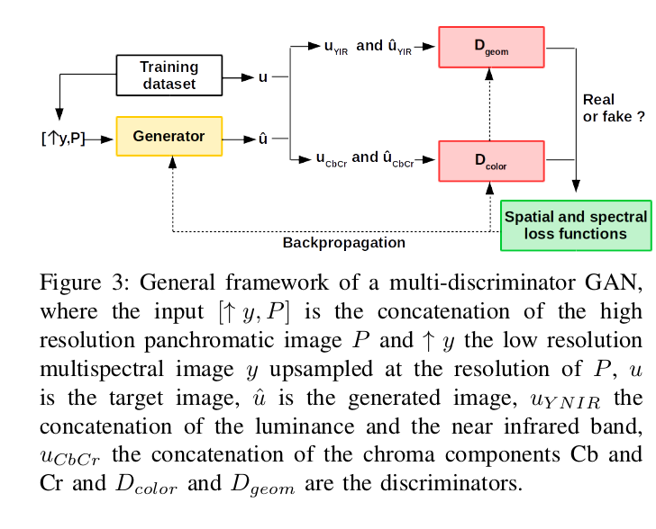
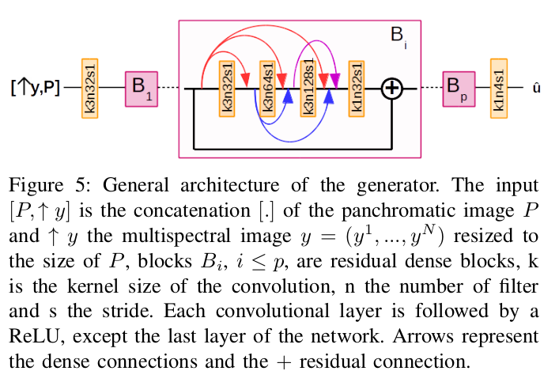
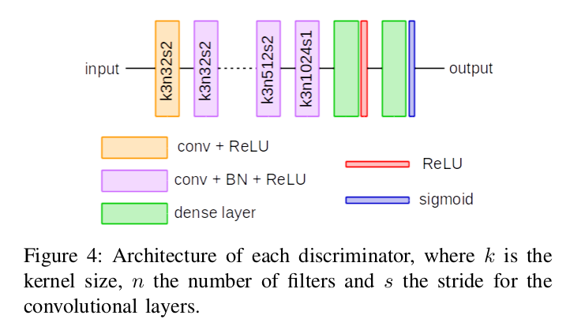
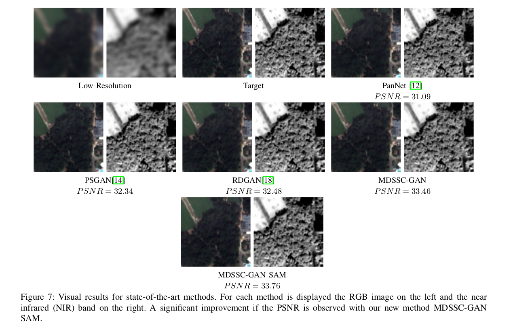
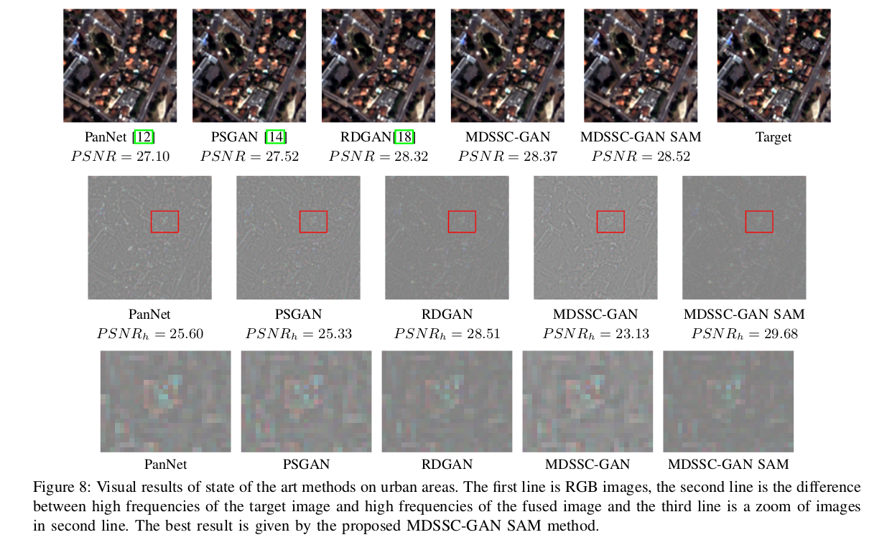
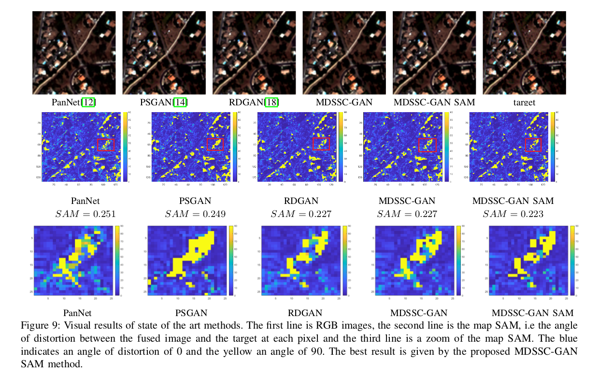

# MDSSC-GAN SAM
Multi-Discriminator with Spectral and Spatial Constraints Adversarial Network for Pansharpening

Anaïs GASTINEAU1,2, Jean-François AUJOL1, Yannick BERTHOUMIEU2 and Christian GERMAIN2

1 Univ. Bordeaux, Bordeaux INP, CNRS, IMB, UMR 5251, F-33400 Talence, France
2 Univ. Bordeaux, Bordeaux INP, CNRS, IMS, UMR 5218, F-33400 Talence, France

Abstract:
The pansharpening problem amounts to fusing a high resolution panchromatic image with a low resolution multispectral image so as to obtain a high resolution multispectral image. So the preservation of the spatial resolution of the panchromatic image and the spectral resolution of the multipsectral image are of key importance for the pansharpening problem. To cope with it, we propose a new method based on multi-discriminator in a Generative Adversarial Network (GAN) framework. Two discriminators are considered. The first one is optimized to preserve textures of images by taking as input the luminance and the near infrared band of images, and the second one preserves the color by comparing the chroma components Cb and Cr. Thus, this method allows to train two discriminators, each one with a different and complementary task. Moreover, to enhance these aspects, the proposed method based on multi-discriminator, and called MDSSC-GAN SAM, considers a spatial and a spectral constraints in the loss function of the generator. We show on numerous examples the advantages of this new method.

### Generator Architecture

### Discriminator Architecture

### Results

We obtain sevral results on Pléiades satellite images.

